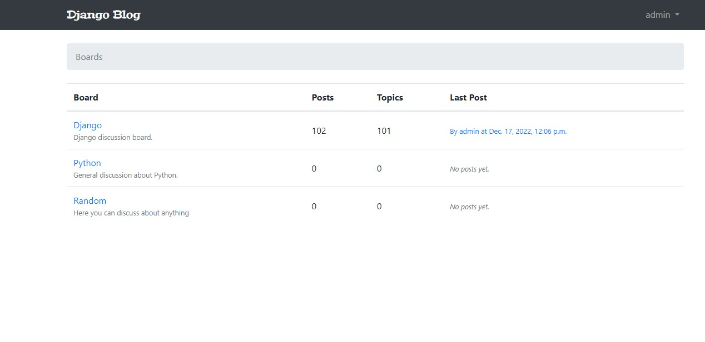

## Django-Blog-App

-- installation de virtual
* py -m pip install --user virtualenv

-- creation d'un environnement virtuel
* py -m venv env

-- Activation
* .\env\Scripts\activate

-- Run
* python3 manage.py runserver

-- Acceuil

